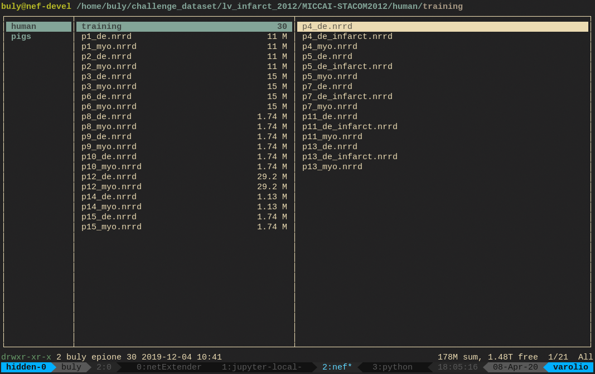

# Miscellaneous
---

<ins>Content:</ins>
- [Ranger: Vim-key binding terminal File Browser](#ranger-vim-key-binding-terminal-file-browser)

---

## Ranger: Vim-key binding terminal File Browser

[GitHub Link](https://github.com/ranger/ranger)

Ranger lets you browse and edit file on the terminal.
There are plenty of `ranger` cheat sheets online.
It might take sometime to get used to, but it can make life easier on the terminal 
and is definitely a better alternative than spamming `ls` every 3 seconds.


```console
user@server:~$ pip install ranger-fm
user@server:~$ ranger
```



If you're not familiar with vim key binding, 
~~what are you doing with your life~~
the following are some basic commands you can do with ranger:

 Command | Key sequence |
 --- | ---
 Moving folder | Arrow keys or `h`:right `j`:down `k`:up and `l`:left
 Select/Unselect file | `space`
 Select All | `v`
 Unselect All | `uv`
 Copy highlight/selected file(s)/folder(s) | `yy`
 Cut highlight/selected file(s)/folder(s) | `dd`
 Paste file into current (middle) folder | `pp`
 Delete highlight/selected file(s)/folder(s) | `dD`
 Run shell command in current folder | `Ctrl+1`
 Run shell command on highlight/select file(s) | `Ctrl+2`


|:exclamation: Unlike the deletion with jupyter, the `dD` uses `rm` to remove file or folder, so once deleted the files are gone.|
|---|
